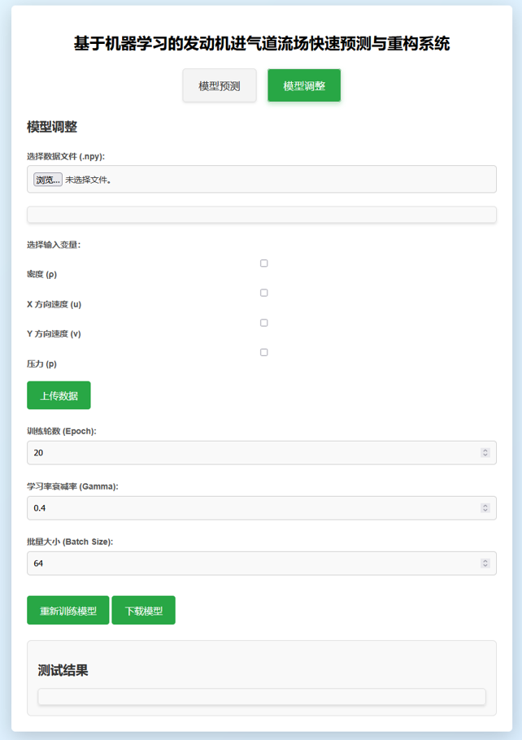

# 基于机器学习的发动机进气道流场快速预测与重构系统
# (Engine Inlet Flow Field Fast Prediction and Reconstruction System)


## 📖 项目简介 | Introduction

本项目是 2024 年大创结题项目成果，专注于利用机器学习（Machine Learning）技术解决航空发动机进气道流场的高效预测问题。

在传统的航空发动机设计中，流场计算（CFD）往往耗时巨大。本项目通过深度学习模型：
* **实现毫秒级预测**：将原本需要数小时的 CFD 计算缩短至秒级。
* **高精度重构**：针对稀疏数据点，实现对复杂流场的高分辨率重构。
* **交互式平台**：基于 Flask 搭建了 Web 演示系统，支持用户在线输入参数并直观查看流场云图。

## 📂 目录结构 | Directory Structure

```text
Engine-Flow-Field-Prediction/
├── app.py              # Flask Web 后端入口
├── requirements.txt    # 环境依赖包列表
├── models/             # 存放预训练模型文件 (.pth)
├── data/               # 处理后的流场数据集
├── templates/          # 系统前端 HTML 页面
├── static/             # 静态资源 (CSS, JS, 预测效果图)
│   └── images/         # 存放 README 展示用的图片
└── uploads/            # 临时上传区

```

## 📊 效果展示 | Demo

### 1. 预测系统主界面


### 2. 流场预测云图对比 (CFD vs ML)

## 🛠️ 技术栈 | Tech Stack

* **核心框架**: Flask (Python)
* **深度学习**: PyTorch (实现流场特征提取与非线性映射)
* **数据可视化**: ECharts / Matplotlib (流场云图渲染)
* **数据处理**: NumPy, Pandas, Scikit-learn

## 🚀 快速开始 | Quick Start

### 1. 环境准备

确保已安装 Python 3.8+，然后安装依赖：

```bash
pip install -r requirements.txt

```

### 2. 启动系统

在项目根目录下运行：

```bash
python app.py

```

访问浏览器 `http://127.0.0.1:5000` 即可使用。

## 👨‍💻 作者 | Author

**高浩轩 (Gao Haoxuan)**
南京航空航天大学 (NUAA) - 人工智能专业

---

*本项目仅供学术交流使用，相关算法细节请参考大创结题报告。*

```
